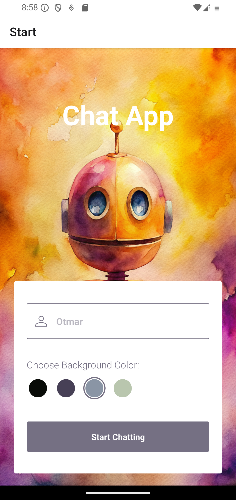
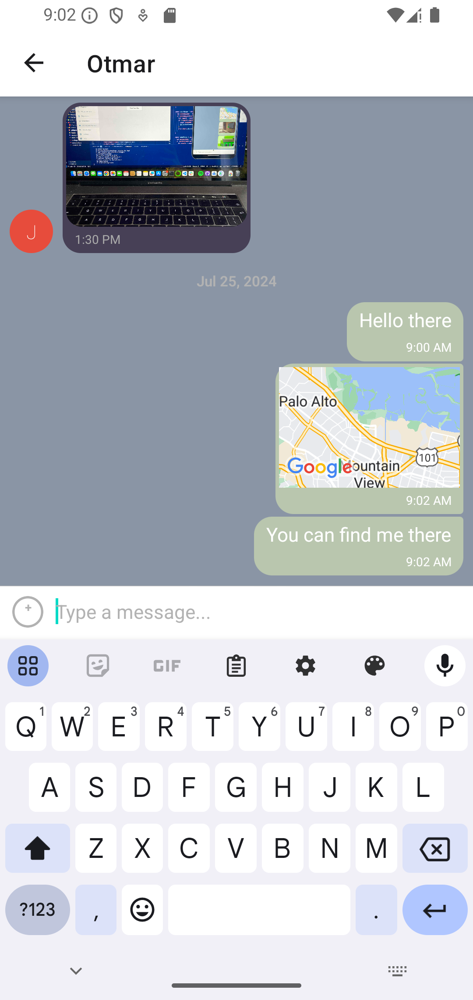
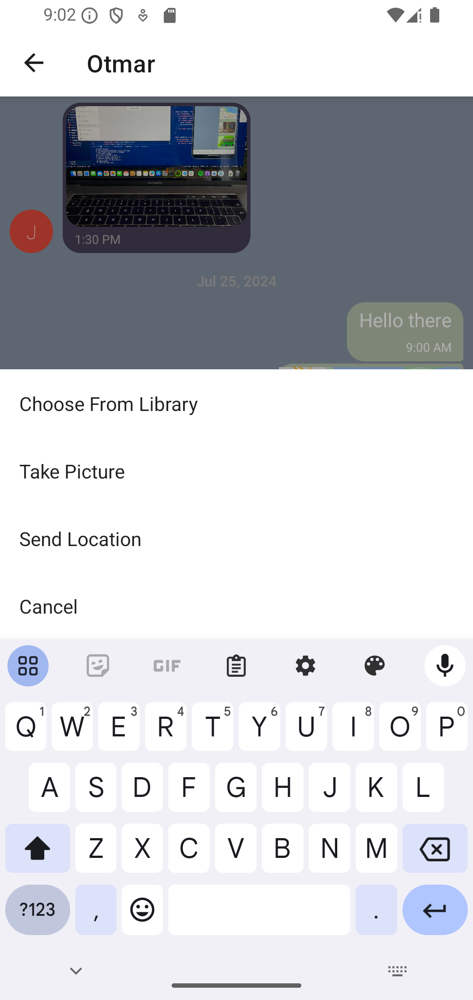

# React Native Mobile Chat App

<!-- toc -->

- [Description](#description)
- [Technologies](#technologies)
- [Setup](#setup)
- [Key Features](#key-features)
  * [User Stories](#user-stories)
  * [Key Features](#key-features-1)
- [Impressions](#impressions)
  * [Start Screen](#start-screen)
  * [Chat View](#chat-view)
  * [Add Media](#add-media)
- [Conclusion](#conclusion)
  * [Challenges](#challenges)
  * [Future Improvements](#future-improvements)
  * [Final Thoughts](#final-thoughts)

<!-- tocstop -->

## Description

This project focuses on creating a mobile chat application using React Native. The primary goal is to offer a seamless chat experience, enabling users to communicate through text messages, share images, and disclose their location. This application caters to the increasing reliance on mobile phones for various daily activities, aligning with the trend of companies prioritizing mobile app development due to its cost-effectiveness and broader reach.

Traditionally, creating apps for different platforms was a costly and time-consuming process, requiring specialized skills. However, the advent of frameworks like React Native has revolutionized this landscape, enabling developers to maintain a single codebase for both Android and iOS platforms.

In this project, I leverage React Native, Expo, and Google Firestore Database to develop a chat application that showcases proficiency in JavaScript mobile development.

## Technologies

- React Native
- Expo
- Google Firestore Database
- Google Firebase Storage
- Gifted Chat Library

## Setup
The app is not registered in the App Store or Google Play Store. Therefore, it can only be run locally. The following steps are necessary to run the app on your smartphone or emulator.

- First, clone the project from [GitHub](https://github.com/OtmarKirch/chat-demo)
- It is recommended to use Node.js 16.19.0 or lower to insure all functionalities. 
- Install all dependencies within `package.json` with NPM
- The app requires a Firestore database and a storage at [Google Firebase](https://firebase.google.com/). Replace the credentials of `firebaseConfig` in `App.js` with your own. Make the data public by setting the rules of the database and storage to `true`: Replace `allow read, write: if false` with `allow read, write: if true`. Set the method of authentication to anonymous.
- You can test the app with [Expo](https://expo.dev/). Create an account and install Expo on your smartphone. Run `npm run start` or `npx expo start`. Then scan the QR code while with the Expo app.
- Testing is also possible with Emulators - Xcode for iOs and Android Studio for Android devices. After starting Expo in the terminal, choose a for an emulated Android device or i for an emulated iOS device.

## Key Features
### User Stories

- As a new user, I want to be able to easily enter a chat room so I can quickly start talking to my friends and family.
- As a user, I want to be able to send messages to my friends and family members to exchange the latest news.
- As a user, I want to send images to my friends to show them what I’m currently doing.
- As a user, I want to share my location with my friends to show them where I am.
- As a user, I want to be able to read my messages offline so I can reread conversations at any time.
- As a user with a visual impairment, I want to use a chat app that is compatible with a screen reader so that I can engage with a chat interface.

### Key Features

- A page where users can enter their name and choose a background color for the chat screen before joining the chat.
- A page displaying the conversation, as well as an input field and submit button.
- The chat must provide users with two additional communication features: sending images and location data.
- Data gets stored online and offline.

## Impressions

### Start Screen
The user is presented with a start screen where they can enter their name and choose a background color for the chat screen. The user can then press the "Start Chatting" button to proceed to the chat screen.

### Chat View

The chat view displays the conversation, an input field, and a submit button. The user can send text messages, images, and their location. The chat messages are displayed in different colors based on the user's background color choice.

### Add Media

The user can send share their location and share images either from their gallery or by taking a photo. In each case, the user is prompted to grant the app access to their location or camera.

## Conclusion

### Challenges
The greatest challenge in this project wasn't the codebase itself but its setup. In order to test the app for android and iOS devices different software is required: for Android, Android Studio is needed, for iOS Xcode. Setting these up with Expo can be a bit overwhelming at first. However, once the setup is done, the development process is very smooth.

### Future Improvements
Modern chat apps provide a wide range of features. With the library `react-native-gifted-chat` many of these can be implemented. As a next step, I would like to implement voice messages, which are very popular in chat apps.
Also, the app does not have a user authentication yet. Therefore, it is necessary to set up a user authentication with Google Firebase. This would allow users to create an account and log in to the chat app.

### Final Thoughts
Creating a chat app with React Native is a great way to learn about mobile development. It is great to be able to cover both, Android and iOS with one codebase. Further, since React Native is based on JavaScript, it is easy to learn and to use. The app is a great starting point for further development and can be expanded with many features. Whether I will continue to develop native apps or use React Native in the future, I am glad to have learned about this technology.